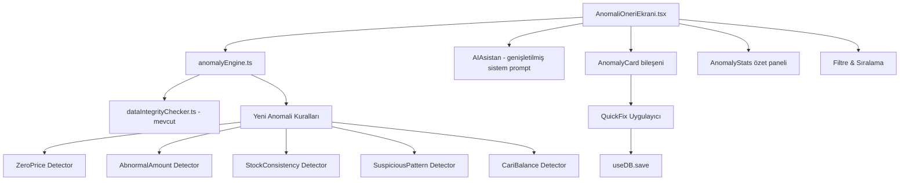
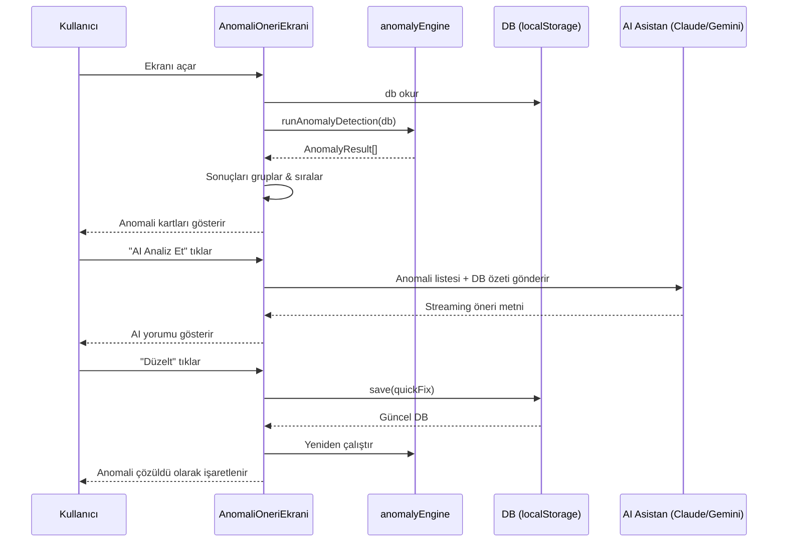

# Tasarım Belgesi: AI Anomali & Öneri Ekranı

## Genel Bakış

Parspel soba işletme yönetim uygulamasına, mevcut `dataIntegrityChecker.ts` ve `AIAsistan.tsx` altyapısı üzerine inşa edilen, gerçek zamanlı anomali tespiti ve AI destekli düzeltme önerileri sunan yeni bir ekran eklenmesi planlanmaktadır. Bu ekran; fiyatsız satışlar, anormal tutar değişimleri, stok tutarsızlıkları, şüpheli kasa hareketleri ve kullanıcının fark etmeyebileceği diğer veri anomalilerini otomatik olarak tespit eder, her anomali için somut düzeltme önerileri sunar ve tek tıkla DB'ye uygulama imkânı tanır.

Mevcut `BugHunter` sayfası statik JavaScript testleri çalıştırırken, bu yeni ekran canlı DB verisi üzerinde çalışır ve AI asistanın kelime haznesini genişleterek anomali tespiti ve düzeltme yetkisi kazandırır.

---

## Mimari



### Veri Akışı



---

## Bileşenler ve Arayüzler

### Bileşen 1: `AnomaliOneriEkrani` (Ana Sayfa)

**Amaç**: Tüm anomali tespiti, filtreleme, AI analizi ve hızlı düzeltme işlemlerini koordine eden ana sayfa bileşeni.

**Arayüz**:
```typescript
interface Props {
  db: DB;
  save?: (updater: (prev: DB) => DB) => void;
}
```

**Sorumluluklar**:
- `anomalyEngine.runAnomalyDetection(db)` çağırarak anomali listesini üretir
- Kategori, önem derecesi ve durum bazlı filtreleme sağlar
- AI analiz modunu tetikler ve streaming yanıtı gösterir
- Hızlı düzeltme işlemlerini `save()` üzerinden uygular
- Anomali sayısını ve sağlık skorunu özetler

---

### Bileşen 2: `anomalyEngine.ts` (Yeni Lib Dosyası)

**Amaç**: Mevcut `dataIntegrityChecker.ts`'i genişleten, iş mantığı odaklı anomali tespit motoru.

**Arayüz**:
```typescript
export type AnomalyCategory =
  | 'fiyat'        // Fiyatsız/sıfır fiyatlı satışlar
  | 'tutar'        // Anormal tutar değişimleri
  | 'stok'         // Stok tutarsızlıkları
  | 'kasa'         // Şüpheli kasa hareketleri
  | 'cari'         // Cari bakiye anomalileri
  | 'siparis'      // Sipariş tutarsızlıkları
  | 'veri'         // Veri kalitesi sorunları
  | 'supheli';     // Belirsiz/şüpheli örüntüler

export type AnomalySeverity = 'critical' | 'warning' | 'info';

export type FixType =
  | 'stok_guncelle'
  | 'kasa_duzelt'
  | 'cari_duzelt'
  | 'satis_iptal'
  | 'manuel';      // Otomatik düzeltilemez, kullanıcı müdahalesi gerekir

export interface QuickFix {
  type: FixType;
  label: string;
  description: string;
  apply: (prev: DB) => DB;  // Saf fonksiyon — DB'yi mutate etmez
  canAutoFix: boolean;
}

export interface AnomalyResult {
  id: string;
  severity: AnomalySeverity;
  category: AnomalyCategory;
  title: string;
  detail: string;
  suggestion: string;
  relatedIds: string[];
  detectedAt: string;       // ISO timestamp
  quickFixes: QuickFix[];
  aiContext: string;        // AI'ya gönderilecek kısa özet
  resolved?: boolean;
}

export interface AnomalyReport {
  anomalies: AnomalyResult[];
  healthScore: number;      // 0-100
  summary: {
    total: number;
    critical: number;
    warning: number;
    info: number;
    byCategory: Record<AnomalyCategory, number>;
  };
  generatedAt: string;
}

export function runAnomalyDetection(db: DB): AnomalyReport;
```

---

### Bileşen 3: `AnomalyCard` (UI Bileşeni)

**Amaç**: Tek bir anomaliyi, önerilerini ve hızlı düzeltme butonlarını gösteren kart bileşeni.

**Arayüz**:
```typescript
interface AnomalyCardProps {
  anomaly: AnomalyResult;
  onFix: (fix: QuickFix) => void;
  onAskAI: (anomaly: AnomalyResult) => void;
  isFixing: boolean;
}
```

**Sorumluluklar**:
- Önem derecesine göre renk kodlaması (kırmızı/sarı/mavi)
- İlgili kayıtlara bağlantı (satış ID, ürün adı, müşteri adı)
- Hızlı düzeltme butonları (canAutoFix=true olanlar için)
- "AI'ya Sor" butonu ile anomaliyi AI asistana iletme

---

### Bileşen 4: `AnomalyStats` (Özet Panel)

**Amaç**: Ekranın üstünde anomali sayılarını ve sağlık skorunu gösteren özet panel.

**Arayüz**:
```typescript
interface AnomalyStatsProps {
  report: AnomalyReport;
  onRefresh: () => void;
  isLoading: boolean;
}
```

---

## Veri Modelleri

### Anomali Tespit Kuralları

Her kural bir `AnomalyDetector` fonksiyonudur:

```typescript
type AnomalyDetector = (db: DB) => AnomalyResult[];
```

Aşağıdaki 8 dedektör uygulanacaktır:

#### Kural 1: Sıfır Fiyatlı Satış Dedektörü (`zeroPriceSalesDetector`)

```typescript
// Tespit: sale.total === 0 VE sale.status === 'tamamlandi'
// Hariç: sale.payment === 'cari' VE sale.total === 0 (hediye/numune olabilir)
// Öneri: Satışı iptal et veya doğru fiyatla yeniden kaydet
// QuickFix: satis_iptal (canAutoFix: true)
```

**Ön koşullar**:
- `sale.deleted !== true`
- `sale.status === 'tamamlandi'`
- `sale.total === 0 || sale.unitPrice === 0`

**Son koşullar**:
- Her sıfır fiyatlı satış için bir `AnomalyResult` üretilir
- `quickFixes` dizisinde en az bir `satis_iptal` fix'i bulunur

#### Kural 2: Anormal Tutar Dedektörü (`abnormalAmountDetector`)

```typescript
// Tespit: Bir satışın tutarı, aynı ürünün son 30 günlük ortalama satış fiyatının
//         3 katından fazla VEYA 1/3'ünden az olması
// Min eşik: Ürün için son 30 günde en az 3 satış olmalı
// Öneri: Fiyat girişini kontrol et
```

**Ön koşullar**:
- Son 30 günde aynı `productId` için en az 3 satış kaydı mevcut
- `sale.unitPrice > 0`

**Son koşullar**:
- Ortalama fiyat hesaplanır: `avg = sum(unitPrice) / count`
- `unitPrice > avg * 3` veya `unitPrice < avg / 3` ise anomali üretilir
- `aiContext` alanında ortalama fiyat ve sapma yüzdesi yer alır

#### Kural 3: Stok Tutarsızlık Dedektörü (`stockConsistencyDetector`)

```typescript
// Tespit: Ürünün mevcut stoğu, stok hareketlerinden hesaplanan beklenen stokla
//         uyuşmuyor (fark > 0)
// Hesaplama: initialStock + sum(giris) - sum(satis+cikis) + sum(iade+duzeltme)
// Öneri: Stok düzeltme hareketi ekle
// QuickFix: stok_guncelle (canAutoFix: true)
```

**Döngü değişmezi**: Her stok hareketi işlenirken `calculatedStock >= 0` koşulu sağlanmalı.

#### Kural 4: Şüpheli Kasa Hareketi Dedektörü (`suspiciousKasaDetector`)

```typescript
// Tespit 1: Aynı gün içinde aynı kasada 5'ten fazla gider kaydı
// Tespit 2: Gider tutarı, o kasanın 30 günlük günlük ortalama giderinin 20 katından fazla
// Tespit 3: Kasa bakiyesi negatife düşüyor (mevcut checker'dan alınır)
// Öneri: İşlemleri doğrula
```

#### Kural 5: Cari Bakiye Anomali Dedektörü (`cariBalanceAnomalyDetector`)

```typescript
// Tespit 1: Müşteri bakiyesi, toplam satışlarından toplam tahsilatlar çıkarıldığında
//           hesaplanan değerden %5'ten fazla sapıyor
// Tespit 2: Tedarikçi bakiyesi negatif (fazla ödeme)
// Tespit 3: Müşteri bakiyesi > 100.000 TL ve son işlem > 90 gün önce
// Öneri: Bakiye mutabakatı yap
// QuickFix: cari_duzelt (canAutoFix: false — manuel onay gerekir)
```

#### Kural 6: Sıfır Adet Satış Dedektörü (`zeroQuantitySalesDetector`)

```typescript
// Tespit: sale.quantity === 0 veya sale.quantity < 0
// Öneri: Satışı iptal et
// QuickFix: satis_iptal (canAutoFix: true)
```

#### Kural 7: Negatif Kâr Marjı Dedektörü (`negativeProfitDetector`)

```typescript
// Tespit: sale.profit < 0 VE sale.total > 0 (zararına satış)
// Hariç: Kasıtlı iskonto ile oluşan zararlar (discount > 0)
// Öneri: Ürün maliyetini veya satış fiyatını kontrol et
```

#### Kural 8: Belirsiz/Yetim Kayıt Dedektörü (`orphanRecordDetector`)

```typescript
// Tespit 1: Kasa kaydı var ama ilgili satış silinmiş (relatedId → deleted sale)
// Tespit 2: Stok hareketi var ama ürün silinmiş
// Tespit 3: Fatura var ama ilgili cari silinmiş
// Öneri: Yetim kaydı temizle veya ilişkilendir
```

---

## Algoritmik Pseudocode

### Ana Tespit Algoritması

```pascal
ALGORITHM runAnomalyDetection(db)
INPUT: db of type DB
OUTPUT: report of type AnomalyReport

BEGIN
  ASSERT db IS NOT NULL
  ASSERT db.sales IS ARRAY
  ASSERT db.products IS ARRAY
  ASSERT db.kasa IS ARRAY

  startTime ← now()
  allAnomalies ← []
  TIMEOUT_MS ← 500

  // Mevcut integrity checker'dan anomalileri al
  integrityIssues ← runIntegrityCheck(db)
  convertedIssues ← convertIntegrityToAnomalies(integrityIssues)
  allAnomalies ← allAnomalies + convertedIssues

  // Yeni dedektörleri çalıştır (timeout korumalı)
  detectors ← [
    zeroPriceSalesDetector,
    abnormalAmountDetector,
    stockConsistencyDetector,
    suspiciousKasaDetector,
    cariBalanceAnomalyDetector,
    zeroQuantitySalesDetector,
    negativeProfitDetector,
    orphanRecordDetector
  ]

  FOR each detector IN detectors DO
    IF (now() - startTime) > TIMEOUT_MS THEN
      BREAK  // Timeout — kısmi sonuç döndür
    END IF

    TRY
      results ← detector(db)
      allAnomalies ← allAnomalies + results
    CATCH error
      // Dedektör hatası tüm sistemi çökertmez
      LOG warning: "Dedektör hatası: " + error.message
    END TRY
  END FOR

  // Tekrar eden anomalileri filtrele (aynı relatedId + category)
  uniqueAnomalies ← deduplicateAnomalies(allAnomalies)

  // Önem derecesine göre sırala: critical > warning > info
  sortedAnomalies ← sortByPriority(uniqueAnomalies)

  healthScore ← calculateHealthScore(sortedAnomalies)
  summary ← buildSummary(sortedAnomalies)

  ASSERT healthScore >= 0 AND healthScore <= 100
  ASSERT summary.total = LENGTH(sortedAnomalies)

  RETURN {
    anomalies: sortedAnomalies,
    healthScore: healthScore,
    summary: summary,
    generatedAt: now()
  }
END
```

**Ön koşullar**:
- `db` null değil ve zorunlu array alanları mevcut
- Her dedektör saf fonksiyon — DB'yi mutate etmez

**Son koşullar**:
- `report.anomalies` tekrar eden kayıt içermez
- `report.healthScore` 0-100 aralığında
- `report.summary.total === report.anomalies.length`

**Döngü değişmezi**: Her dedektör çalıştırıldığında `allAnomalies` yalnızca yeni anomaliler eklenir, mevcut anomaliler değişmez.

---

### Hızlı Düzeltme Uygulama Algoritması

```pascal
ALGORITHM applyQuickFix(db, fix)
INPUT: db of type DB, fix of type QuickFix
OUTPUT: newDb of type DB

BEGIN
  ASSERT fix IS NOT NULL
  ASSERT fix.canAutoFix = true
  ASSERT fix.apply IS FUNCTION

  // Saf fonksiyon — orijinal db değişmez
  newDb ← fix.apply(db)

  ASSERT newDb IS NOT NULL
  ASSERT newDb !== db  // Yeni referans oluşturulmuş olmalı

  // Düzeltme sonrası anomali yeniden tespit edilmemeli
  // (Bu assertion test ortamında doğrulanır)

  RETURN newDb
END
```

---

### AI Bağlam Oluşturma Algoritması

```pascal
ALGORITHM buildAnomalyContext(db, anomalies)
INPUT: db of type DB, anomalies of type AnomalyResult[]
OUTPUT: context of type string

BEGIN
  criticalCount ← COUNT(anomalies WHERE severity = 'critical')
  warningCount ← COUNT(anomalies WHERE severity = 'warning')

  context ← buildContext(db)  // Mevcut AIAsistan buildContext fonksiyonu

  context ← context + "\n\n## 🚨 TESPİT EDİLEN ANOMALİLER\n"
  context ← context + "Kritik: " + criticalCount + " | Uyarı: " + warningCount + "\n\n"

  FOR each anomaly IN anomalies.slice(0, 20) DO
    context ← context + "### " + anomaly.severity.toUpperCase() + ": " + anomaly.title + "\n"
    context ← context + anomaly.aiContext + "\n"
    context ← context + "Öneri: " + anomaly.suggestion + "\n\n"
  END FOR

  context ← context + "\n## 🛠️ ANOMALİ DÜZELTME TALİMATLARI\n"
  context ← context + "Kullanıcı anomali düzeltmesi istediğinde uygun action bloğu ekle.\n"
  context ← context + "Mevcut action tipleri: sale, kasa_gelir, kasa_gider, stok_guncelle, cari_tahsilat\n"

  RETURN context
END
```

---

## Örnek Kullanım

```typescript
// 1. Anomali tespiti
const report = runAnomalyDetection(db);
console.log(`${report.summary.critical} kritik anomali tespit edildi`);
console.log(`Sağlık skoru: ${report.healthScore}/100`);

// 2. Hızlı düzeltme uygulama
const anomaly = report.anomalies[0];
const fix = anomaly.quickFixes.find(f => f.canAutoFix);
if (fix) {
  save(prev => fix.apply(prev));
}

// 3. AI'ya anomali gönderme
const context = buildAnomalyContext(db, report.anomalies);
// context AIAsistan'ın sistem prompt'una eklenir

// 4. Filtreli görünüm
const criticalOnly = report.anomalies.filter(a => a.severity === 'critical');
const priceAnomalies = report.anomalies.filter(a => a.category === 'fiyat');
```

---

## Hata Yönetimi

### Hata Senaryosu 1: Dedektör Timeout

**Koşul**: Anomali tespiti 500ms'yi aşıyor (büyük DB)
**Yanıt**: Timeout'a kadar tamamlanan dedektörlerin sonuçları döndürülür, kullanıcıya "Kısmi sonuç" uyarısı gösterilir
**Kurtarma**: Kullanıcı "Yenile" butonuyla yeniden çalıştırabilir

### Hata Senaryosu 2: Hızlı Düzeltme Başarısız

**Koşul**: `fix.apply(db)` exception fırlatıyor
**Yanıt**: `save()` çağrılmaz, kullanıcıya hata toast'u gösterilir
**Kurtarma**: Kullanıcı manuel düzeltme yapabilir

### Hata Senaryosu 3: AI Analizi Başarısız

**Koşul**: Claude/Gemini API erişilemiyor
**Yanıt**: Offline fallback — anomali listesi ve statik öneriler gösterilir
**Kurtarma**: Bağlantı gelince "Yeniden Dene" butonu aktif olur

### Hata Senaryosu 4: DB Boş veya Yetersiz Veri

**Koşul**: `db.sales.length === 0` veya `db.products.length === 0`
**Yanıt**: "Henüz yeterli veri yok" boş durum ekranı gösterilir
**Kurtarma**: Veri girildikçe ekran otomatik güncellenir

---

## Test Stratejisi

### Birim Test Yaklaşımı

Her dedektör fonksiyonu izole olarak test edilir:

```typescript
// zeroPriceSalesDetector testi
const mockDB = createMockDB({
  sales: [
    { id: 's1', total: 0, unitPrice: 0, status: 'tamamlandi', quantity: 1 },
    { id: 's2', total: 500, unitPrice: 500, status: 'tamamlandi', quantity: 1 },
  ]
});
const results = zeroPriceSalesDetector(mockDB);
expect(results).toHaveLength(1);
expect(results[0].relatedIds).toContain('s1');
expect(results[0].quickFixes[0].canAutoFix).toBe(true);
```

### Özellik Tabanlı Test Yaklaşımı

**Test Kütüphanesi**: fast-check (mevcut projede kullanılıyor)

**Özellik 1**: Sağlık skoru her zaman 0-100 aralığında olmalı
```typescript
fc.property(fc.record({ sales: fc.array(...), products: fc.array(...) }), (db) => {
  const report = runAnomalyDetection(db);
  return report.healthScore >= 0 && report.healthScore <= 100;
});
```

**Özellik 2**: Anomali tespiti DB'yi mutate etmemeli
```typescript
fc.property(arbitraryDB, (db) => {
  const frozen = JSON.stringify(db);
  runAnomalyDetection(db);
  return JSON.stringify(db) === frozen;
});
```

**Özellik 3**: Hızlı düzeltme uygulandıktan sonra aynı anomali yeniden tespit edilmemeli
```typescript
fc.property(arbitraryDBWithZeroPriceSale, (db) => {
  const before = zeroPriceSalesDetector(db);
  const fix = before[0].quickFixes[0];
  const newDb = fix.apply(db);
  const after = zeroPriceSalesDetector(newDb);
  return after.length < before.length;
});
```

### Entegrasyon Test Yaklaşımı

- `runAnomalyDetection` → `AnomalyCard` render → `applyQuickFix` → `runAnomalyDetection` döngüsü
- AI bağlam oluşturma: `buildAnomalyContext` çıktısının geçerli sistem prompt formatında olduğu doğrulanır

---

## Performans Değerlendirmeleri

- **Hesaplama sınırı**: Tüm dedektörler toplamda 500ms timeout ile korunur
- **Memoization**: `useMemo` ile `runAnomalyDetection(db)` sonucu cache'lenir; DB değişmediği sürece yeniden hesaplanmaz
- **Büyük DB**: `db.sales.length > 5000` durumunda son 90 günlük satışlar üzerinde çalışılır
- **Render optimizasyonu**: `AnomalyCard` bileşenleri `React.memo` ile sarılır; yalnızca değişen kartlar yeniden render edilir
- **Lazy loading**: Ekran ilk açıldığında yalnızca critical anomaliler gösterilir; diğerleri "Tümünü Göster" ile açılır

---

## Güvenlik Değerlendirmeleri

- Hızlı düzeltme fonksiyonları (`fix.apply`) saf fonksiyondur — doğrudan DB mutasyonu yapmaz, `save()` üzerinden geçer
- `save()` içindeki mevcut Rule Engine ve Audit Log mekanizmaları tüm düzeltmeler için çalışmaya devam eder
- AI'ya gönderilen bağlam metni kişisel veri içerebilir (müşteri adları, bakiyeler) — mevcut AIAsistan güvenlik politikası geçerlidir
- Anomali tespiti salt okunur işlemdir — DB'yi değiştirmez

---

## Bağımlılıklar

### Mevcut (Değişiklik Gerektirmeyen)
- `parspel/src/lib/dataIntegrityChecker.ts` — `runIntegrityCheck`, `detectAnomalies` fonksiyonları yeniden kullanılır
- `parspel/src/pages/AIAsistan.tsx` — `buildContext`, `askClaude`, `askGemini`, `offlineReply` fonksiyonları yeniden kullanılır
- `parspel/src/hooks/useDB.ts` — `save()` fonksiyonu
- `parspel/src/types/index.ts` — `DB`, `Sale`, `KasaEntry`, `Product`, `Cari` tipleri
- `parspel/src/lib/utils-tr.ts` — `formatMoney`, `genId`

### Yeni Dosyalar
- `parspel/src/lib/anomalyEngine.ts` — Yeni anomali tespit motoru
- `parspel/src/pages/AnomaliOneri.tsx` — Yeni sayfa bileşeni

### App.tsx Değişikliği
- `TABS` dizisine yeni sekme eklenir: `{ id: 'anomali', label: 'Anomali & Öneri', icon: '🔍', group: 'Analiz' }`
- `AnomaliOneri` bileşeni import edilir ve ilgili `case` bloğu eklenir

---

## UI/UX Tasarım Notları

Mevcut uygulamanın koyu tema stiline uygun:

```
┌─────────────────────────────────────────────────────────┐
│ 🔍 Anomali & Öneri Ekranı          [Yenile] [AI Analiz] │
├─────────────────────────────────────────────────────────┤
│ Sağlık Skoru: 72/100  │ 3 Kritik │ 7 Uyarı │ 4 Bilgi   │
├─────────────────────────────────────────────────────────┤
│ [Tümü] [Kritik] [Uyarı] [Bilgi] │ Kategori ▼ │ Ara...  │
├─────────────────────────────────────────────────────────┤
│ 🔴 KRİTİK — Fiyatsız Satış                              │
│ "Soba Model X" 15.01.2025 tarihinde 0 TL'ye satıldı    │
│ Öneri: Satışı iptal edip doğru fiyatla yeniden kaydedin │
│ [🔧 Satışı İptal Et] [🤖 AI'ya Sor]                    │
├─────────────────────────────────────────────────────────┤
│ 🟡 UYARI — Anormal Tutar                                │
│ "Boru 6m" son 30 günlük ort. 450 TL iken 2.100 TL      │
│ Öneri: Fiyat girişini kontrol edin (%367 sapma)         │
│ [🤖 AI'ya Sor]                                          │
└─────────────────────────────────────────────────────────┘
```

Renk kodlaması:
- Kritik: `rgba(220,38,38,0.15)` arka plan, `#dc2626` metin
- Uyarı: `rgba(245,158,11,0.1)` arka plan, `#f59e0b` metin
- Bilgi: `rgba(59,130,246,0.1)` arka plan, `#3b82f6` metin
- Çözüldü: `rgba(16,185,129,0.1)` arka plan, `#10b981` metin
